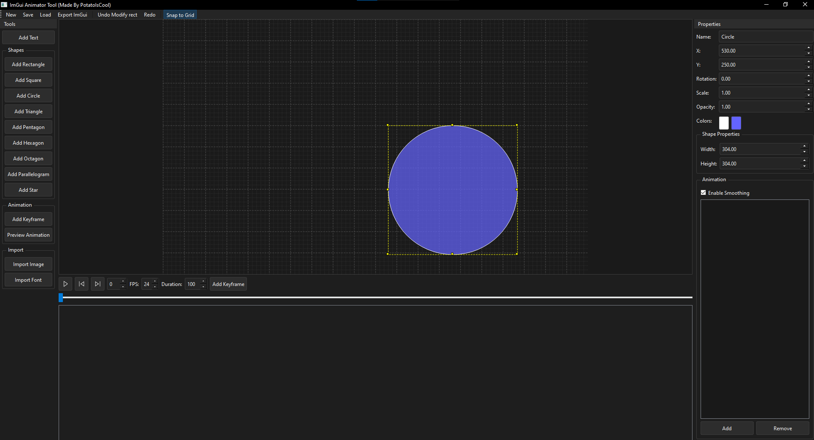

# Imgui Animations

A PySide6 based animation editor and code exporter made to create animated UI layouts for ImGui (Dear ImGui).

## WARNING!!
This project has a LOT of bugs.
The code got very messy and complicated to the point it was getting annoying to fix
Here are the current bugs I can list off the top of my head
- X, Z cords are messed up (they scale weird)
- The changing text feature sometimes works.
- Adjusting the shapes/Items a lot/fast causes them to break the item interaction feature
- I also need to make a way so it plays the animation smooth on the render not just the code


## Features

- Keyframe based animation editor
- Editable shapes and text items
- Resizable and draggable elements
- Undo/redo support
- SnapToGrid toggle
- Timeline with frame control
- Save/load renders (unable to load imgui code tho)
- Export to ImGui code

## Installation

Make sure you got python installed and you have pip on path.

```bash
pip install PySide6
```
## Roadmap / To do when im better at python

- Fix X/Z coordinate scaling
- Smooth animation playback in preview
- Support loading from exported ImGui C++ code
- Make it so I can import fonts, images, etc
- I would also like to add a settings tab (have feautes like Changing the theme of the menu. Or enabling smoothing.)

# Its designed for:
- Developers who want animation without manually writing frame code
- Quick layout testing and visual scripting for UI movement
- For lazy people only :3
